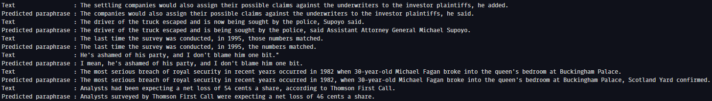

# Mutate

Mutate is a paraphrasing tool that aims at generating text of equivalent meaning from a given passage with a high degree of accuracy. Mutate uses BART which is an encoder-decoder transformer developed by Meta (previously known as facebook) and has been performing very well on sequence to sequence tasks where generation along with bidirectional understanding of the text is crucial.



## Example

The following snippets demostrates the level of paraphrasing that is achieved so far

```
Text                 : The settling companies would also assign their possible claims against the underwriters to the investor plaintiffs, he added.
Predicted paraphrase : The companies would also assign their possible claims against the underwriters to the investor plaintiffs, he said.
Text                 : The driver of the truck escaped and is now being sought by the police, Supoyo said.
Predicted paraphrase : The driver of the truck escaped and is being sought by the police, said Assistant Attorney General Michael Supoyo.
Text                 : The last time the survey was conducted, in 1995, those numbers matched.
Predicted paraphrase : The last time the survey was conducted, in 1995, the numbers matched.
Text                 : He's ashamed of his party, and I don't blame him one bit."
Predicted paraphrase : I mean, he's ashamed of his party, and I don't blame him one bit.
Text                 : The most serious breach of royal security in recent years occurred in 1982 when 30-year-old Michael Fagan broke into the queen's bedroom at Buckingham Palace.
Predicted paraphrase : The most serious breach of royal security in recent years occurred in 1982, when 30-year-old Michael Fagan broke into the queen's bedroom at Buckingham Palace, Scotland Yard confirmed.
Text                 : Analysts had been expecting a net loss of 54 cents a share, according to Thomson First Call.
Predicted paraphrase : Analysts surveyed by Thomson First Call were expecting a net loss of 46 cents a share.
```

## Train Model from Source

**Getting the Dataset**

We have used the [Microsoft Research Paraphrase Corpus](https://www.microsoft.com/en-us/download/details.aspx?id=52398) which is available as a [kaggle dataset](https://www.kaggle.com/datasets/doctri/microsoft-research-paraphrase-corpus) in a more user friendly format.

Extract the dataset in a folder named `data` in the parent directory.

**Training the Model**

Edit the `src/config.py` file according to your requirements and execute the following commands:

```
pip install -r requirements.txt
make
```

## TODOs

- [x] Decide the dataset
- [x] Train BART model
- [ ] Write an API
- [ ] Make a website
- [ ] Make desktop app (As BART is huge, desktop app would be have a reasonable latency compared to a website)
